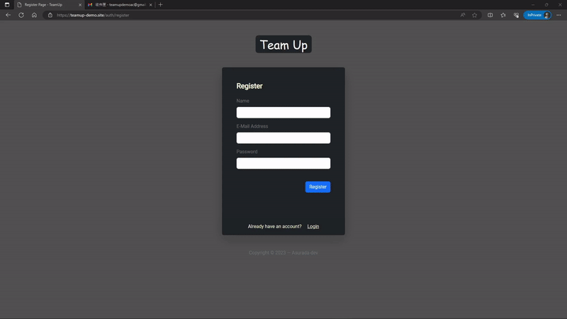
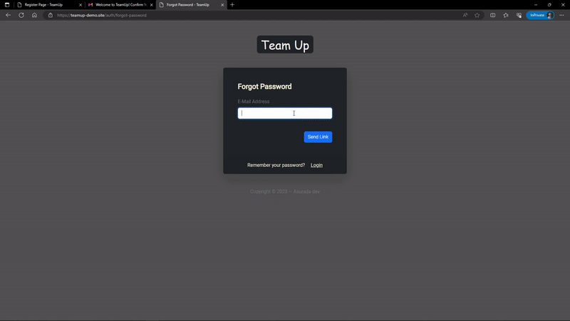
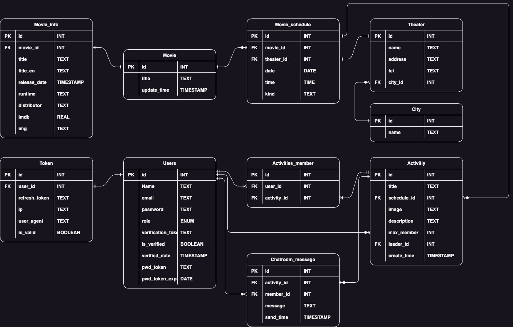

# Team-Up

Team-Up is a social website that encourage you to find someone to watch movies with and share your experience.

Website URL: https://teamup-demo.site/

Sample account: teamupdemoac@gmail.com / Password: teamup456 (or create your own)

API Docs: https://teamup-demo.site/api-docs

---

## Main Features

- Register a new account using your email address.

- Receive a verification email from the server to confirm your email address.

  

- Authenticate users with JWT (access token and refresh token).

- Create an activity by selecting a movie and its playing time, and you can upload an activity image.

  

- Update or Delete the activities.

- Join and Leave the activities.

- Utilize Socket.IO to implement the real-time chatroom, including:

  - Loading the chat log
  - Real-time chatting
  - Switching between the Online / Offline status

  

- Reset users password.

  

- Automatically update the movies and schedules database by the web crawler and the daily cron job.

---

## Techniques

### Runtime

- Node.js

### Web Framework

- Express.js

### Relational Database Management System (RDBMS)

- PostgreSQL

### Cloud Service(AWS)

- EC2
- VPC
- RDS
- S3

### Web Server

- Nginx

### Real-time Communication

- Socket.IO

### Mail Service

- SendGrid

### Authentication

- JSON Web Token(JWT)

### Server Side Rendering

- EJS

### Front-end

- Javascript
- CSS
- Axios
- Bootstrap 5

## Web Crawler (Python)

### Framework

- Scrapy

### Features

- The web crawler is designed to extract from the [Yahoo!電影戲劇](https://movies.yahoo.com.tw/) website.

- It utilizes various spiders to crawl the different data, including:

  - movie_id: Get the unique identification numbers(IDs) of movies from the website.

  - movie_info: Get detailed information about movies by the unique movie IDs.

  - movie_schedule: Get the movie playing time and theater information by the unique movie IDs.

  - movie_city: Get the list of cities and its unique IDs.

  - movie_theater: Get information about theater around Taiwan.

- Parse the response data with CSS Selector or BeautifulSoup libary.

- Process and insert the extracted data into the AWS RDS (Relational Database Service) using the scrapy pipelines.

- Set up a cron job on the Ubuntu OS that running on the AWS EC2 instance to schedule the crawling process.

## Database Schema

